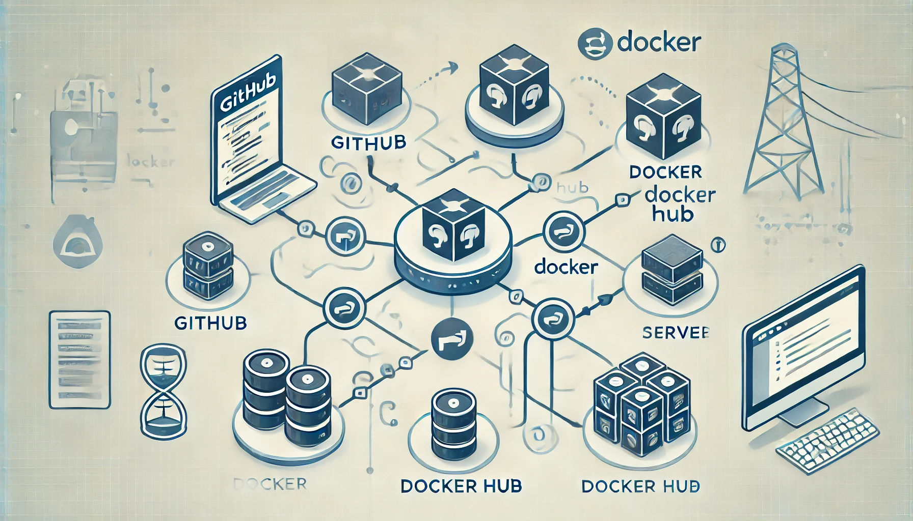

# Docker Push Workflow

This repository contains resources for automating Docker image creation and deployment using GitHub Actions and Docker. It includes a workflow for building an HTTPD-based Docker image, pushing it to Docker Hub, and running it on self-hosted runners.

## Repository Overview

### Files:
1. **`gh_docker.yml`**  
   - Automates:
     - Login to Docker Hub.
     - Place this file inside the .github/workflows directory
     - Docker image build and push on github-hosted runners.
     - Running containers on self-hosted runners.

2. **`Dockerfile`**  
   - Creates an HTTPD-based image.
   - Downloads and deploys the "Carvilla" website template.

## Features

- **Automatic Build & Push**: GitHub Actions workflow tags images using `github.run_number` and pushes them to Docker Hub.
- **Self-Hosted Deployment**: Supports deploying and running containers on custom runners.

## Workflow Visualization

## Usage Instructions

1. **Setup Secrets**:
   - `DOCKER_USERNAME`: Docker Hub username.
   - `DOCKER_PASSWORD`: Docker Hub access token.

2. **Trigger the Workflow**:
   - Push changes to the repository to start the GitHub Actions workflow.

3. **Customize Dockerfile**:
   - Update the `Dockerfile` to suit your project needs.

## Contributions

Contributions are welcome! Fork the repository and submit pull requests to enhance workflows or Docker configurations.